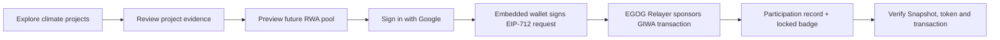
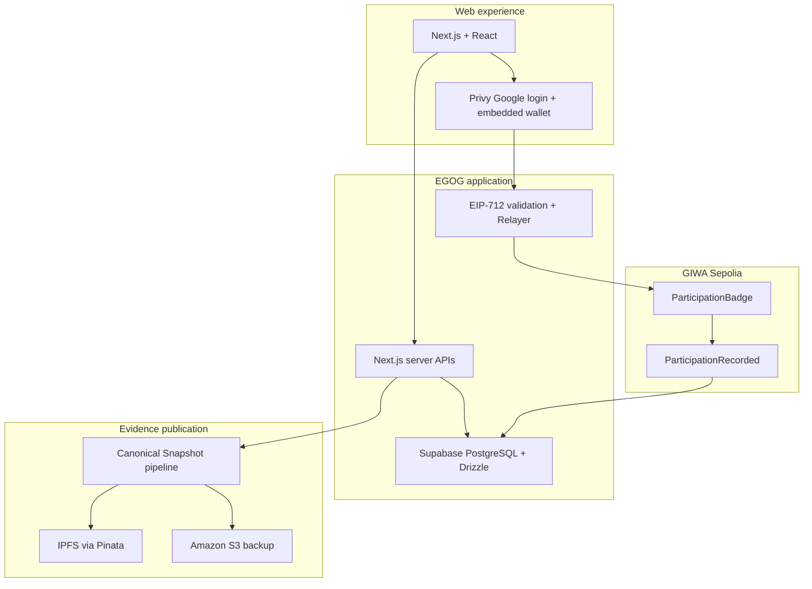

<div align="center">
  <a href="https://egog.io">
    
  </a>

  <h1>Real-world climate assets, verifiable on-chain</h1>

  <p>
    EGOG connects versioned climate-project evidence with signed participation
    records and non-transferable badges on GIWA Sepolia.
  </p>

  <p>
    <a href="https://egog.io"><strong>Explore EGOG</strong></a>
    ·
    <a href="https://github.com/EGOG-newtonne/EGOG-Contracts">Smart contracts</a>
    ·
    <a href="https://egog.notion.site/">Technical overview</a>
  </p>

  <p>
    
    
    
    
  </p>
</div>

---

## What is EGOG?

EGOG is a climate RWA participation platform. It lets people:

- discover real-world climate projects and their supporting evidence;
- review immutable, versioned public Snapshots;
- sign project-specific participation intent with an embedded wallet;
- receive a gas-sponsored, non-transferable participation badge on GIWA Sepolia;
- verify the exact Snapshot hash, URI, member number, token, and transaction later.

The current product includes three project experiences:

| Project | Experience | Participation |
| --- | --- | --- |
| Vietnam Brick Project | Project monitoring, methodology, Snapshot history, and climate RWA pool preview | Open |
| Jeju ERW Project | Field photography, sensor evidence, methodology, and evidence Snapshot | Open |
| Solar Mobility Project | Project and future climate RWA pool preview | Coming soon |

> [!IMPORTANT]
> Project status and source provenance are shown in the application. A Snapshot
> hash proves that a published version has not changed; it does not by itself
> prove Registry issuance, carbon-credit ownership, retirement, investment
> rights, or financial returns.

## Product flow



No asset is deposited during this flow. The RWA pool screens are illustrative
product previews, not live financial markets.

## How the evidence stays connected

Each participation request binds the user to one exact project Snapshot:

```text
Project evidence
  → canonical public Snapshot JSON
  → deterministic Snapshot hash + IPFS URI
  → EIP-712 user signature
  → GIWA ParticipationRecorded event
  → non-transferable ERC-721 / ERC-5192 badge
```

Historical participation records keep their original Snapshot reference even
when a project publishes a newer version.

## Architecture



## Technology

- **Application:** Next.js 16, React, TypeScript, Privy, viem
- **Data:** Supabase PostgreSQL, Drizzle ORM, Zod
- **Blockchain:** GIWA Sepolia, Solidity 0.8.28, Hardhat 3, OpenZeppelin 5
- **Storage:** IPFS through Pinata with Amazon S3 backups
- **Quality:** Vitest, Hardhat tests, Playwright, ESLint, TypeScript
- **Delivery:** Vercel and Supabase Cron-based on-chain reconciliation

## Repository layout

```text
apps/
  web/                    Next.js application, APIs and database runtime
packages/
  contracts/              Solidity, Hardhat scripts and contract tests
  contract-types/         Published ABI and deployment addresses
  shared/                 Snapshot, EIP-712 and cross-runtime utilities
data/
  projects/               Project seeds and public Snapshot definitions
scripts/                  Publication, seeding, sync and verification tools
docs/                     Architecture, runbooks, QA and submission evidence
```

The independently reviewable contract source is also published at
[`EGOG-newtonne/EGOG-Contracts`](https://github.com/EGOG-newtonne/EGOG-Contracts).

## Local development

### Requirements

- Node.js `24.13.x`
- pnpm `10.33.x`
- PostgreSQL or a Supabase development project

### Start

```bash
pnpm install
cp .env.example apps/web/.env.local
pnpm db:migrate
pnpm seed:projects --env=dev
pnpm dev
```

Open [http://localhost:3000](http://localhost:3000).

Environment values are validated at startup. Server credentials must remain in
server-only environment variables and must never use the `NEXT_PUBLIC_` prefix.
Do not commit `.env` files, private keys, database URLs, or provider secrets.

## Verification

```bash
pnpm lint
pnpm typecheck
pnpm test
pnpm test:contracts
pnpm build
```

Operational checks:

```bash
pnpm sync:onchain
pnpm verify:demo
```

Supporting material:

- [Demo operations](docs/runbooks/demo-operations.md)
- [External prerequisites](docs/runbooks/external-prerequisites.md)
- [MVP verification](docs/qa/2026-07-13-mvp-verification.md)
- [Jeju ERW activation evidence](docs/qa/2026-07-27-jeju-erw-activation.md)

## Smart contract

| Field | Value |
| --- | --- |
| Contract | `ParticipationBadge` |
| Network | GIWA Sepolia Testnet |
| Chain ID | `91342` |
| Address | [`0xf06aDA399160D208D3629EBeEAAF628266BE23A6`](https://sepolia-explorer.giwa.io/address/0xf06aDA399160D208D3629EBeEAAF628266BE23A6) |
| Solidity | `0.8.28` |
| Optimizer | Enabled, 200 runs, `viaIR: true` |
| Standards | ERC-721, ERC-5192, EIP-712 |

The deployment is live and used by the application. The public contract
repository contains the auditable source, tests, compiler settings, constructor
facts, and reproducibility notes. GIWA Explorer source-code verification is
tracked separately and must not be inferred solely from a successful deployment.

## Security model

- Users sign the exact project, Snapshot, metadata, nonce, and deadline.
- Only the registered Relayer can submit `joinBySig`.
- The Relayer cannot mint without a valid participant signature.
- Admin and Relayer roles use separate addresses.
- A wallet can participate only once per project.
- Badges cannot be transferred or approved.
- On-chain events are the source of truth; the database is a reconciled cache.
- Personal information and email consent are never written on-chain.

Please report security issues privately to the EGOG team. Do not include
credentials, private keys, or personal data in a public issue.

## Legal boundary

The participation badge is non-transferable. It does not represent an
investment, financial return, carbon-credit ownership, retirement claim,
purchase right, or guaranteed future benefit. Illustrative RWA pool figures are
not live market data or an offer of a financial product.
